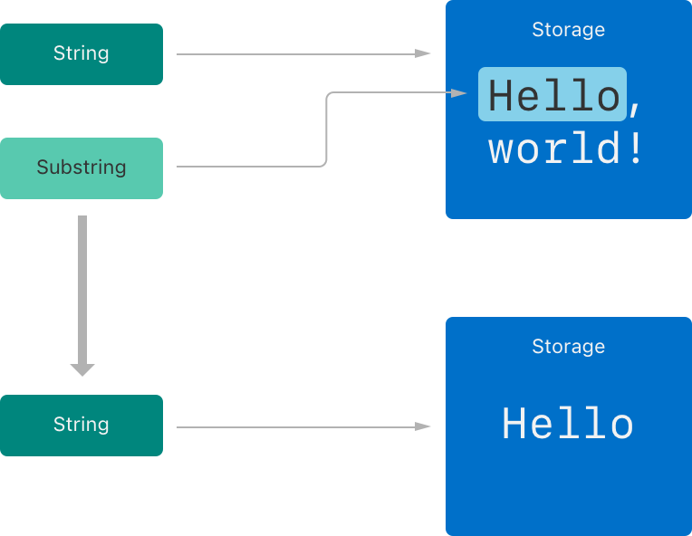

# Swift - Basics<!-- omit from toc -->

[Swift documentations 1](https://docs.swift.org/swift-book/documentation/the-swift-programming-language/thebasics/),
[Swift documentations 2](https://docs.swift.org/swift-book/documentation/the-swift-programming-language/stringsandcharacters)

- [Constants and Variables](#constants-and-variables)
  - [Type Annotations](#type-annotations)
  - [Naming Convention](#naming-convention)
- [Comments](#comments)
- [Semicolons](#semicolons)
- [Basic Types](#basic-types)
  - [Integers](#integers)
  - [Floating-Point Numbers](#floating-point-numbers)
  - [Booleans](#booleans)
  - [Tuples](#tuples)
  - [Strings](#strings)
  - [Characters](#characters)
- [Unicode](#unicode)
  - [Unicode Scalar Values](#unicode-scalar-values)
  - [Extended Grapheme Clusters](#extended-grapheme-clusters)
  - [Unicode Representations of Strings](#unicode-representations-of-strings)
- [Numeric Literals](#numeric-literals)
- [Numeric Type Conversion](#numeric-type-conversion)
- [Optionals](#optionals)
  - [Forced Unwrapping](#forced-unwrapping)
  - [Optional Binding](#optional-binding)
  - [Implicitly Unwrapped Optionals](#implicitly-unwrapped-optionals)
  - [Optional Chaining](#optional-chaining)
- [Type Safety and Type Inference](#type-safety-and-type-inference)
- [Error Handling](#error-handling)
- [Assertions and Preconditions](#assertions-and-preconditions)
  - [Assertions](#assertions)
  - [Preconditions](#preconditions)

## Constants and Variables

- Type of variables or constants can't be changed after declaration
- Value of constants can't be changed after declaration

```swift
let maximumNumberOfLoginAttempts = 10
// maximumNumberOfLoginAttempts = 9 // compile-time error
var currentLoginAttempt = 0
// currentLoginAttempt = "a" // compile-time error
var x = 0.0, y = 0.0, z = 0.0
```

### Type Annotations

```swift
var welcomeMessage: String
var red, green, blue: Double
typealias AudioSample = UInt16 
// you can use the alias anywhere you might use the original name
```

### Naming Convention

Constant and variable names can contain *almost* any character, including Unicode characters

- no whitespace characters, mathematical symbols, arrows
- no line- and box-drawing characters
- can't begin with a number

No variables or constants can be declared with same name.

[AVOID] To declare a constant or variable with the same name as a reserved Swift keyword, surround the keyword with backticks (``)

```swift
let π = 3.14159
let 你好 = "你好世界"
let 🐶🐮 = "dogcow"
```

## Comments

```swift
// This is a comment.
/* This is also a comment
but is written over multiple lines. */
/* This is the start of the first multiline comment.
    /* This is the second, nested multiline comment. */
This is the end of the first multiline comment. */
```

## Semicolons

optional unless multiple separate statements on a single line

```swift
let cat = "🐱"; print(cat)
```

## Basic Types

### Integers

Use the `Int` type for all general-purpose integer constants and variables, even if they’re known to be nonnegative.

- Integer constants and variables are immediately interoperable
- match the inferred type for integer literal values

Use other integer types only when they’re specifically needed for the task at hand:

- explicitly sized data from an external source
- performance or memory usage optimization
- catch overflows

Use unsigned interger (`UInt`) *only* when you specifically need an unsigned integer type with the same size as the platform’s native word size.

#### Signed Intergers<!-- omit from toc -->

Get bound for a type:

```swift
let minValue = Int.min
let maxValue = Int.max
```

| type    | size    | min                  | max                 | Java |
| ------- | ------- | -------------------- | ------------------- | ---- |
| `Int8`  | 8 bits  | -128                 | 127                 | byte |
| `Int16` | 16 bits | -32768               | 32767               | long |
| `Int32` | 32 bits | -2147483648          | 2147483647          | int  |
| `Int64` | 64 bits | -9223372036854775808 | 9223372036854775807 | long |

#### Unsigned Intergers<!-- omit from toc -->

| type     | size    | min | max                  | Java |
| -------- | ------- | --- | -------------------- | ---- |
| `UInt8`  | 8 bits  | 0   | 255                  | -    |
| `UInt16` | 16 bits | 0   | 65535                | -    |
| `UInt32` | 32 bits | 0   | 4294967295           | -    |
| `UInt64` | 64 bits | 0   | 18446744073709551615 | -    |

#### Int and UInt<!-- omit from toc -->

- On a 32-bit platform, `Int` / `Uint` is the same size as `Int32` / `UInt32`.
- On a 64-bit platform, `Int` / `Uint` is the same size as `Int64` / `Uint64`.

### Floating-Point Numbers

- [Prefered] `Double` represents a 64-bit floating-point number.
  - `Double` has a precision of at least 15 decimal digits
- `Float` represents a 32-bit floating-point number.
  - The precision of `Float` can be as little as 6 decimal digits

### Booleans

Swift provides two Boolean constant values, true and false.

```swift
let someBool: Bool
let orangesAreOrange = true
let turnipsAreDelicious = false
```

### Tuples

- The values within a tuple can be of any type
- and don’t have to be of the same type as each other

```swift
let http404Error = (404, "Not Found")
// http404Error is of type (Int, String)
let (statusCode, statusMessage) = http404Error // decompose tuple
let (justTheStatusCode, _) = http404Error
print("The status code is \(http404Error.0)") // indexing
let http200Status = (statusCode: 200, description: "OK") // named tuple
print("The status code is \(http200Status.statusCode)")
```

### Strings

#### String Literals<!-- omit from toc -->

- String literals can include the following special characters:
  - The escaped special characters `\0` (null character), `\\` (backslash), `\t` (horizontal tab), `\n` (line feed), `\r` (carriage return), `\"` (double quotation mark) and `\'` (single quotation mark)
  - An arbitrary Unicode scalar, written as `\u{n}`, where n is a 1–8 digit hexadecimal number with a value equal to a valid Unicode code point
- Multiline string literals:
  - The string must begin on the first line after the opening quotation marks (`"""`), and end on the line before the closing quotation marks, which means that neither of the strings `singleLineString` and `multipleString` start or end with a line break.
  - If you want to use line breaks to make your source code easier to read, but you don’t want the line breaks to be part of the string’s value, write a backslash (`\`) at the end of those lines.
  - A multiline string can be indented to match the surrounding code. The whitespace before the closing quotation marks (`"""`) tells Swift what whitespace to ignore before all of the other lines. However, if you write whitespace at the beginning of a line in addition to what’s before the closing quotation marks, that whitespace isn’t ignored.
    

```swift
var emptyString = "" // empty string literal
var anotherEmptyString = String() // initializer syntax
let someString = "Some string literal value"
let quotation = """
The White Rabbit put on his spectacles.  "Where shall I begin,
please your Majesty?" he asked.

"Begin at the beginning," the King said gravely, "and go on
till you come to the end; then stop."
"""

let singleLineString = "These are the same."
let multilineString = """
These are the same.
"""

let softWrappedQuotation = """
The White Rabbit put on his spectacles.  "Where shall I begin, \
please your Majesty?" he asked.

"Begin at the beginning," the King said gravely, "and go on \
till you come to the end; then stop."
"""
```

#### Special Characters in String Literals<!-- omit from toc -->

String literals can include the following special characters:

- The escaped special characters `\0` (null character), `\\` (backslash), `\t` (horizontal tab), `\n` (line feed), `\r` (carriage return), `\"` (double quotation mark) and `\'` (single quotation mark)
- An arbitrary Unicode scalar, written as `\u{n}`, where n is a 1–8 digit hexadecimal number with a value equal to a valid Unicode code point
- To include the text """ in a multiline string, escape at least one of the quotation marks.

```swift
let wiseWords = "\"Imagination is more important than knowledge\" - Einstein"
// "Imageination is more important than knowledge" - Einstein
let sparklingHeart = "\u{1F496}" // 💖, Unicode scalar U+1F496
let threeDoubleQuotationMarks = """
Escaping the first quotation mark \"""
Escaping all three quotation marks \"\"\"
"""
```

#### String Mutability<!-- omit from toc -->

```swift
var variableString = "Horse"
variableString += " and carriage"

let constantString = "Highlander"
constantString += " and another Highlander" // compile-time error
```

#### String Are Value Types<!-- omit from toc -->

Swift's `String` type is a *value* type. If you create a new `String` value, that `String` value is copied when it’s passed to a function or method, or when it’s assigned to a constant or variable. In each case, a new copy of the existing `String` value is created, and the new copy is passed or assigned, not the original version.

#### Concatenating Strings and Characters<!-- omit from toc -->

```swift
let string1 = "hello"
let string2 = " there"
var welcome = string1 + string2
// welcome now equals "hello there"
var instruction = "look over"
instruction += string2
// instruction now equals "look over there"
let exclamationMark: Character = "!"
welcome.append(exclamationMark)
// welcome now equals "hello there!"
string1 + exclamationMark // compile-time error
```

#### String Interpolation<!-- omit from toc -->

```swift
let multiplier = 3
let message = "\(multiplier) times 2.5 is \(Double(multiplier) * 2.5)"
// message is "3 times 2.5 is 7.5"
```

#### Extended String Delimiters<!-- omit from toc -->

You can place a string literal within extended delimiters to include special characters in a string without invoking their effect. You place your string within **quotation marks** (`"`) and surround that with **number signs** (`#`).

If you need the special effects of a character in a string literal, match the number of number signs within the string literal following the escape character (`\`).

```swift
let threeMoreDoubleQuotationMarks = #"""
Here are three more double quotes: """
"""#
print(#"Write an interpolated string in Swift using \(multiplier)."#)
// Prints "Write an interpolated string in Swift using \(multiplier)."
print(#"6 times 7 is \#(6 * 7)."#)
// Prints "6 times 7 is 42."
let lineBreaks = ###"Line1\###nLine2"###
// Prints "Line1
// Line2"
```

#### Counting Characters<!-- omit from toc -->

Note that Swift’s use of extended grapheme clusters for Character values means that string concatenation and modification may not always affect a string’s character count.

Because extended grapheme clusters can be composed of multiple Unicode scalars, characters in Swift don’t each take up the same amount of memory within a string’s representation. As a result, the number of characters in a string can’t be calculated without iterating through the string to determine its extended grapheme cluster boundaries. If you are working with particularly long string values, be aware that the count property must iterate over the Unicode scalars in the entire string in order to determine the characters for that string.

```swift
let unusualMenagerie = "Koala 🐨, Snail 🐌, Penguin 🐧, Dromedary 🐪"
print("unusualMenagerie has \(unusualMenagerie.count) characters")
// Prints "unusualMenagerie has 40 characters"

var word = "cafe"
print("the number of characters in \(word) is \(word.count)")
// Prints "the number of characters in cafe is 4"
word += "\u{301}"    // COMBINING ACUTE ACCENT, U+0301
print("the number of characters in \(word) is \(word.count)")
// Prints "the number of characters in café is 4"
```

#### Accessing and Modifying a String<!-- omit from toc -->

Each `String` value has an associated *index type*, `String.Index`, which corresponds to the position of each `Character` in the string.

- `startIndex`: the position of the first character in a nonempty string
- `endIndex`: the position after the last character in a string
  - `endIndex` isn’t a valid argument to a string’s subscript
  - `startIndex` and `endIndex` are equal for an empty string
- `index(before:)`: the previous index
- `index(after:)`: the next index
- `index(_:offsetBy:)`: the index offset by a specified distance
- `indices`: a range of all of the indexes used to access individual characters in a string
- `insert(_:at:)`: insert a character at a specified index
- `insert(contentsOf:at:)`: insert a string at a specified index
- `remove(at:)`: remove a character at a specified index
- `removeSubrange(_:)`: remove a substring at a specified range
- `removeAll()`: remove all characters

```swift
let greeting = "Guten Tag!"
greeting[greeting.startIndex] // G
greeting[greeting.index(before: greeting.endIndex)] // !
greeting[greeting.index(after: greeting.startIndex)] // u
let index = greeting.index(greeting.startIndex, offsetBy: 7)
greeting[index] // a
greeting[greeting.endIndex] // runtime error
greeting.index(after: greeting.endIndex) // runtime error
for index in greeting.indices {
    print("\(greeting[index]) ", terminator: "")
}
// Prints "G u t e n   T a g ! "
var welcome = "hello"
welcome.insert("!", at: welcome.endIndex) // hello!
welcome.insert(contentsOf: " there", at: welcome.index(before: welcome.endIndex)) // hello there!
welcome.remove(at: welcome.index(before: welcome.endIndex)) // hello there
let range = welcome.index(welcome.endIndex, offsetBy: -6)..<welcome.endIndex
welcome.removeSubrange(range) // hello
```

#### Substrings<!-- omit from toc -->

- Substrings in Swift have most of the same methods as strings.
- The difference between strings and substrings is that, as a performance optimization, a substring can reuse part of the memory that’s used to store the original string, or part of the memory that’s used to store another substring.
    
- Substrings are used for only a short amount of time while performing actions on a string. When you’re ready to store the result for a longer time, you convert the substring to an instance of `String`.
- Both `String` and `Substring` conform to the `StringProtocol` protocol, which means it’s often convenient for string-manipulation functions to accept a StringProtocol value. You can call such functions with either a String or Substring value.

```swift
let greeting = "Hello, world!"
let index = greeting.firstIndex(of: ",") ?? greeting.endIndex
let beginning = greeting[..<index] // Hello
// Convert the result to a String for long-term storage.
let newString = String(beginning)
```

#### Comparing Strings<!-- omit from toc -->

Swift provides three ways to compare textual values: string and character equality, prefix equality, and suffix equality.

- `==` and `!=` to compare two strings
  - Two `String` values (or two `Character` values) are considered equal if their extended grapheme clusters are *canonically* equivalent. Extended grapheme clusters are canonically equivalent if they have the *same linguistic meaning and appearance*, even if they’re composed from different Unicode scalars behind the scenes.
- `hasPrefix(_:)` and `hasSuffix(_:)` to check whether a string has a particular string prefix or suffix

```swift
let quotation = "We're a lot alike, you and I."
let sameQuotation = "We're a lot alike, you and I."
if quotation == sameQuotation {
    print("These two strings are considered equal")
}
// Prints "These two strings are considered equal"

let eAcuteQuestion = "Voulez-vous un caf\u{E9}?"
let combinedEAcuteQuestion = "Voulez-vous un caf\u{65}\u{301}?"
if eAcuteQuestion == combinedEAcuteQuestion {
    print("These two strings are considered equal")
}
// Prints "These two strings are considered equal"

let romeoAndJuliet = [
    "Act 1 Scene 1: Verona, A public place",
    "Act 1 Scene 2: Capulet's mansion",
    "Act 1 Scene 3: A room in Capulet's mansion",
    "Act 1 Scene 4: A street outside Capulet's mansion",
    "Act 1 Scene 5: The Great Hall in Capulet's mansion",
    "Act 2 Scene 1: Outside Capulet's mansion",
    "Act 2 Scene 2: Capulet's orchard",
    "Act 2 Scene 3: Outside Friar Lawrence's cell",
    "Act 2 Scene 4: A street in Verona",
    "Act 2 Scene 5: Capulet's mansion",
    "Act 2 Scene 6: Friar Lawrence's cell"
]
var act1SceneCount = 0
for scene in romeoAndJuliet {
    if scene.hasPrefix("Act 1 ") {
        act1SceneCount += 1
    }
}
```

### Characters

```swift
let thisIsAString = "!"
let exclamationMark: Character = "!"
let catCharacters: [Character] = ["C", "a", "t", "!", "🐱"]
let catString = String(catCharacters)
print(catString)
// Prints "Cat!🐱"
```

## Unicode

Unicode is an international standard for encoding, representing, and processing text in different writing systems. It enables you to represent almost any character from any language in a standardized form, and to read and write those characters to and from an external source such as a text file or web page.

### Unicode Scalar Values

Behind the scenes, Swift’s native `String` type is built from Unicode scalar values. A Unicode scalar is a unique 21-bit number for a character or modifier, such as U+0061 for LATIN SMALL LETTER A (`"a"`), or U+1F425 for FRONT-FACING BABY CHICK (`"🐥"`).

### Extended Grapheme Clusters

Every instance of Swift’s `Character` type represents a single extended grapheme cluster. An extended grapheme cluster is a sequence of one or more Unicode scalars that (when combined) produce a single human-readable character.

```swift
let eAcute: Character = "\u{E9}" // é
let combinedEAcute: Character = "\u{65}\u{301}" // e followed by ́
// eAcute is é, combinedEAcute is é
let precomposed: Character = "\u{D55C}" // 한
let decomposed: Character = "\u{1112}\u{1161}\u{11AB}" // ᄒ, ᅡ, ᆫ
// precomposed is 한, decomposed is 한
let enclosedEAcute: Character = "\u{E9}\u{20DD}"
// enclosedEAcute is é⃝
let regionalIndicatorForUS: Character = "\u{1F1FA}\u{1F1F8}"
// regionalIndicatorForUS is 🇺🇸
```

### Unicode Representations of Strings

Swift provides several different ways to access Unicode representations of strings. You can iterate over the string with a `for`-`in` statement, to access its individual `Character` values as Unicode extended grapheme clusters.

Alternatively, access a `String` value in one of three other Unicode-compliant representations:

- A collection of UTF-8 code units (accessed with the string’s `utf8` property)
- A collection of UTF-16 code units (accessed with the string’s `utf16` property)
- A collection of 21-bit Unicode scalar values, equivalent to the string’s UTF-32 encoding form (accessed with the string’s `unicodeScalars` property)

```swift
let dogString = "Dog‼🐶"
for codeUnit in dogString.utf8 {
    print("\(codeUnit) ", terminator: "")
}
print("")
// Prints "68 111 103 226 128 188 240 159 144 182 "
for codeUnit in dogString.utf16 {
    print("\(codeUnit) ", terminator: "")
}
print("")
// Prints "68 111 103 8252 55357 56374 "
for scalar in dogString.unicodeScalars {
    print("\(scalar.value) ", terminator: "")
}
print("")
// Prints "68 111 103 8252 128054 "
```

## Numeric Literals

- Hexadecimal floating-point literals must end with an exponent of `x`, the base number is multiplied by `2^x`

```swift
let decimalInteger = 17;
let binaryInteger = 0b10001
let octalInteger = 0o21
let hexadecimalInteger = 0x11
let decimalDouble = 12.1875
let exponentDouble = 1.21875e1 // 1.21875 * 10^1
let hexadecimalDouble = 0xC.3p0 // (12 * 16^0 + 3 * 16^-1) * 2^0
let paddedDouble = 000123.456 // prefix zeros are allowed
let oneMillion = 1_000_000
let justOverOneMillion = 1_000_000.000_000_1
```

## Numeric Type Conversion

Because each numeric type can store a different range of values, you must opt in to numeric type conversion on a case-by-case basis (explicit conversion) to prevent hidden conversion errors and helps make type conversion intentions explicit in your code.

```swift
let cannotBeNegative: UInt8 = -1 // compile error
// No implicit conversion
let someNegInt = -1
let someNegUInt: UInt = someNegInt // compile error

let three = 3
let pointOneFourOneFiveNine = 0.14159
let pi = three + pointOneFourOneFiveNine // compile error
let pi = Double(three) + pointOneFourOneFiveNine
// pi equals 3.14159, and is inferred to be of type Double

let anotherPi = 3 + 0.14159
// this works as literal value of 3 has no explicit type in and of itself

// Hidden errors
let negInt = -1
let negUInt = UInt(negInt) // runtime error

let integerPi = Int(pi) // Double to Int
// always truncated: 4.75 -> 4; -3.9 -> -3
```

## Optionals

*Optionals* are used in situations where a value may be absent.

Optional can be declared by adding a question mark after a type.

```swift
var surveyAnswer: String? // surveyAnswer is automatically set to nil
var serverResponseCode: Int? = 404
serverResponseCode = nil
```

### Forced Unwrapping

Optional can be **foreced unwrapped** to a non-optionl by adding an exclamation point (`!`) at the end of the optional's name.

Forced unwrapping an optional set to `nil` will cause runtime error, thus you should always wrap it in an `if` statement.

```swift
convertedNumber: Int? = Int("404")
if convertedNumber != nil {
    print("convertedNumber contains integer value of \(convertedNumber!).") // forced unwrapping
}
```

### Optional Binding

**Optional binding** is used to find out 1) whether an optional contains a value, 2) and if so, to make that value available as a *temporary* constant or variable.

Optional binding can be used with `if` and `while` statements.

```swift
if let <#constantName#> = <#someOptional#> {
   <#statements#>
}
```

If the conversion is successful, the local variabel or constant becomes available for use within the first branch of the if statement. It has already been initialized with the value contained within the optional, and so you don’t use the `!` suffix to access its value.

Optional can be binding to varialbe and changes to the local variable doesn't change the optional.

You can use the same name as the optional for the new constant or variable

```swift
let myNumber = Int(possibleNumber)
// Here, myNumber is an optional integer
if let myNumber = myNumber {
    // Here, myNumber is a non-optional integer
    print("My number is \(myNumber)")
}
// Here, myNumber is an optional integer
```

or even simplier:

```swift
if let myNumber {
    print("My number is \(myNumber)")
}
```

More than one optional bindings and Boolean conditions can be used in a single `if` statement, separated by commas:

```swift
if let firstNumber = Int("4"), let secondNumber = Int("42"), firstNumber < secondNumber && secondNumber < 100 {
    print("\(firstNumber) < \(secondNumber) < 100")
}
```

### Implicitly Unwrapped Optionals

**Implicitly unwrapped optionals** are useful when an optional’s value is confirmed to exist immediately after the optional is first defined and can definitely be assumed to exist at every point thereafter. The primary use of implicitly unwrapped optionals in Swift is during class initialization, as described in [Unowned References and Implicitly Unwrapped Optional Properties](https://docs.swift.org/swift-book/documentation/the-swift-programming-language/automaticreferencecounting#Unowned-References-and-Implicitly-Unwrapped-Optional-Properties).

You write an implicitly unwrapped optional by placing an exclamation point (`String!`) rather than a question mark (`String?`) after the type that you want to make optional.

**An implicitly unwrapped optional is a normal optional** behind the scenes (can be used in optional binding), but can also be used like a non-optional value, without the need to unwrap the optional value each time it’s accessed. If an implicitly unwrapped optional is `nil` and you try to access its wrapped value, you’ll trigger a runtime error.

```swift
let assumedString: String! = "An implicitly unwrapped optional string."
let implicitString: String = assumedString // no need for an exclamation point
```

When you use an implicitly unwrapped optional value, Swift first tries to use it as an ordinary optional value; if it can’t be used as an optional, Swift force-unwraps the value.

```swift
let optionalString = assumedString
// The type of optionalString is "String?" and assumedString isn't force-unwrapped.
```

### Optional Chaining

- Optional Chaining is a process for querying and calling properties, methods, and subscripts on an optional that might currently be nil
- If the optional contains a value, the property, method, or subscript call succeeds; if the optional is nil, the property, method, or subscript call returns nil
- Place a question mark (`?`) after the optional value
- The result of an optional chaining call is always an optional value of the type you are trying to retrieve, even if the property, method, or subscript you are querying returns a non-optional value
  - Specifically, if a function doesn't return a value, it returns `Void`; then the result of the optional chaining call is `Void?`
  - This is also applicable to setting a property and retrieve/set a value from a subscript through optional chaining which returns `Void?`
- Optional chaining can be used in assignments, and if it fails, none of the code on the right hand side of the assignment operator is run

```swift
class Person {
    var residence: Residence?
}

class Residence {
    var rooms: [Room] = []
    var numberOfRooms: Int {
        rooms.count
    }
    subscript(i: Int) -> Room {
        get {
            rooms[i]
        }
        set {
            rooms[i] = newValue
        }
    }
    func printNumberOfRooms() {
        print("The number of rooms is \(numberOfRooms)")
    }
}

var person = Person()
person.residence?.printNumberOfRooms() // return nil of type Void?
```

## Type Safety and Type Inference

Swift is a **type-safe** language and performs type checks during compilation.

Swift uses **type inference** to work out the appropriate type. Type inference enables a compiler to deduce the type of a particular expression automatically when it compiles your code, simply by examining the values you provide.

Type inference is particularly useful when you declare a constant or variable with an initial value.

```swift
let anotherPi = 3 + 0.14159
// anotherPi is also inferred to be of type Double
```

The literal value of 3 has no explicit type in and of itself (it is not of type Int!). See [Type Safety and Type Inference](#type-safety-and-type-inference) for more details

## Error Handling

In contrast to optionals, which can use the presence or absence of a value to communicate success or failure of a function, error handling allows you to determine the underlying cause of failure, and, if necessary, propagate the error to another part of your program.

A function indicates that it can throw an error by including the throws keyword in its declaration.

```swift
func canThrowAnError() throws {
    // this function may or may not throw an error
}
```

Swift automatically propagates errors out of their current scope until they’re handled by a catch clause.

```swift
do {
    try canThrowAnError()
    // no error was thrown
} catch {
    // an error was thrown
}
```

Here’s an example of how error handling can be used to respond to *different* error conditions:

```swift
func makeASandwich() throws {
    // ...
}


do {
    try makeASandwich()
    eatASandwich()
} catch SandwichError.outOfCleanDishes {
    washDishes()
} catch SandwichError.missingIngredients(let ingredients) {
    buyGroceries(ingredients)
}
```

## Assertions and Preconditions

Assertions and preconditions are checks that happen at **runtime**.

You use assertions and preconditions to express the assumptions you make and the expectations you have while coding, so you can include them as part of your code. Assertions help you find mistakes and incorrect assumptions during **development**, and preconditions help you detect issues in **production**.

Unlike the error conditions discussed in [Error Handling](#error-handling) above, **assertions and preconditions aren’t used for recoverable or expected errors**. Because a failed assertion or precondition indicates an invalid program state, there’s no way to catch a failed assertion.

The difference between assertions and preconditions is in when they’re checked: Assertions are checked only in debug builds, but preconditions are checked in both debug and production builds. In production builds, the condition inside an assertion isn’t evaluated. This means you can use as many assertions as you want during your development process, without impacting performance in production.

### Assertions

`assert(_:_:file:line:)` function

```swift
let age = -3
assert(age >= 0, "A person's age can't be less than zero.")
// This assertion fails because -3 isn't >= 0.
```

If the code already checks the condition, you use the `assertionFailure(_:file:line:)` function to indicate that an assertion has failed.

```swift
if age > 10 {
    print("You can ride the roller-coaster or the ferris wheel.")
} else if age >= 0 {
    print("You can ride the ferris wheel.")
} else {
    assertionFailure("A person's age can't be less than zero.")
}
```

### Preconditions

Use a precondition whenever a condition has the potential to be false, but must definitely be true for your code to continue execution.

`precondition(_:_:file:line:)` function

```swift
// In the implementation of a subscript...
precondition(index > 0, "Index must be greater than zero.")
```

You can also call the `preconditionFailure(_:file:line:)` function to indicate that a failure has occurred — for example, if the default case of a switch was taken, but all valid input data should have been handled by one of the switch’s other cases.

> If you compile in unchecked mode `(-Ounchecked)`, preconditions aren’t checked. The compiler assumes that preconditions are always true, and it optimizes your code accordingly. However, the `fatalError(_:file:line:)` function always halts execution, regardless of optimization settings.
> You can use the `fatalError(_:file:line:)` function during prototyping and early development to create stubs for functionality that hasn’t been implemented yet, by writing fatalError("Unimplemented") as the stub implementation. Because fatal errors are never optimized out, unlike assertions or preconditions, you can be sure that execution always halts if it encounters a stub implementation.
